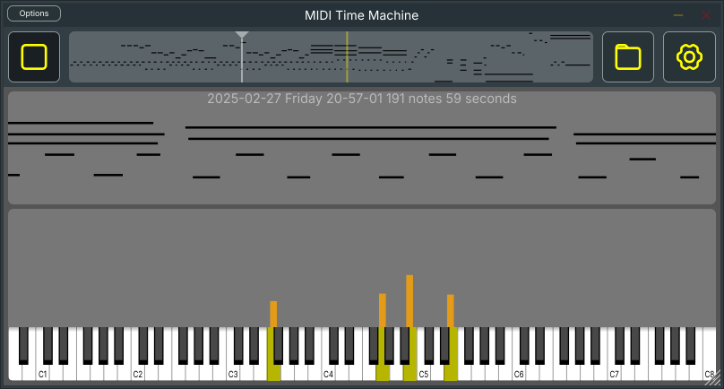

# MIDI Time Machine

An audio plugin or standalone application for capturing and replaying MIDI performances - designed to help you review what you just played, quickly.

## Features

- Automatically captures MIDI input and saves each piece to a separate file.
- One-button playback of your last recorded piece.
- Visual feedback with a piano roll and velocity display to help with timing, articulation, and dynamics.
- Drag and drop from the MIDI roll to import recordings directly into your DAW.

## How?

Insert the plugin into your FX chain, before your virtual instruments. It will silently capture all MIDI passing through it and save each piece automatically.

The standalone application works the same way, but requires you to route your MIDI input through the application settings.

## Why?

There are too many things to pay attention when playing piano. Listening back to a fresh take is the fastest way to catch things your fingers didn't notice - whether notes are truly legato or detached, or whether the voicing of a chord is balanced the way you intended. The velocity display makes dynamics visible at a glance.

## License

This project is licensed under the [GNU General Public License v3.0](LICENSE).
